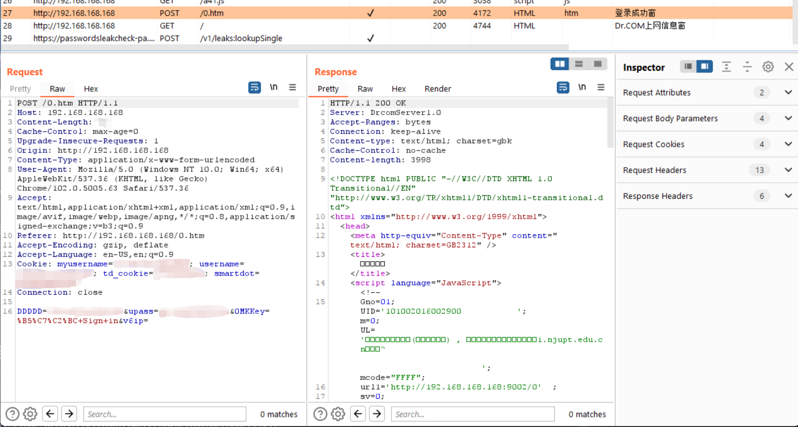

# 校园网断网自动重连脚本

适用于Linux操作系统，且该脚本仅在计算机学科楼测试可用

## 文件描述

原理：发送带有账户信息的`POST`数据包



- `autoauth.sh` 用于填入你的账户信息并发送`POST`数据包进行认证操作
- `whether_online.sh` 用于判断是否断网，如果断网则执行脚本`autoauth.sh`进行联网操作

## Linux Crontab 定时任务

借助Linux Crontab 定时任务将`whether_online.sh`脚本设置为定时任务，每`1min`执行一次，即可保证断网时间不超过`2min`，参考：

```txt
# 每分钟执行一次
* * * * * sh /path/to/whether_online.sh
```

## 安装

1. 拉取本项目代码
```bash
git clone https://github.com/CCCougar/autoReconnect.git
cd autoReconnect
```

2. 在`autoauth.sh`中填入自己的校园网账户信息

3. 在`crontab.conf`中输入正确的`whether_online.sh`路径

4. 注册定时任务

```bash
crontab crontab.conf
```

## Credits

- [NUPT_net_autoauth](https://github.com/karsacui/NUPT_net_autoauth)
- SQL@213